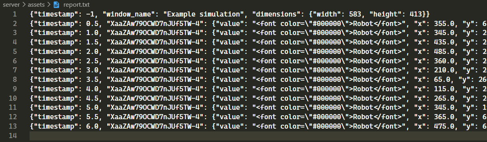

This is a plugin to view simulations generated by HMRSsim simulator.
Currently only works in offline mode.

This project has 2 parts, a [server](#server) and a [client](#client). The server parses report files (which contains snapshots of simulations) and handles each step to the client. The client displays the simulation. You are free to use just one of them if you'd like.

# Server

The server reads the simulations, parses them into steps, and sends each step to the client upon request.
## Simulation snapshots
Simulation snapshots are simple `.txt` files. The first like contain general information about the simulation, in JSON format, and all the other lines on the file contain a snapshot[^1] of some point of the simulation, also in JSON format. See example below.



> ℹ
> 
> Currently, the server is set to look for a file named `report.txt` in the `assets/` directory.


[^1]: Actually each step is a delta of the last step, with just the information related to objects that changed position or some other caracteristic since the previous step. It's the server's job to re-create the snapshot completely from the delta.

## Running the server

1. Build the files
   
Because the server is coded using TypeScript, we must first transpile the files into JavaScript. Files are transpiles into the `dist/` folder.

```bash
$ cd server
$ tsc
```

2. Run the file

```bash
$ node dist/index.js
```
> ℹ
>
> Server is set up to run on port 3005.

# Client

The client is responsible for displaying the simulation using `mxGraph` library.

## Extra models

Your simulations may use extra models, that are not part of the core of `mxClient`. To include these models (so you can see them in the display), you may have to do something similar to what's on `src/models/`. Use that as an example. You can also check documantation for `registerShape` [here](https://jgraph.github.io/mxgraph/docs/js-api/files/view/mxCellRenderer-js.html).

Remeber to import them in `App.js`.

## Running the client

Simplest way, in dev mode, is with `yarn start`.